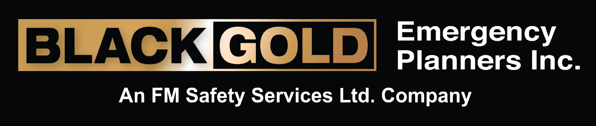

<!doctype html><html lang="en"><head><meta charset="utf-8"><meta name="viewport" content="width=device-width, initial-scale=1"><title>Black Gold Connect</title><meta name="description" content="Black Gold Connect digital business cards and client connection portal."><link rel="manifest" href="site.webmanifest"><link rel="stylesheet" href="assets/css/style.css"></head><body><a class="skip" href="#main">Skip to content</a><header class="site-header">
<a class="brand" href="index.html">Connect</a><nav class="nav" aria-label="Main navigation"><a href="index.html">Home</a><a href="team.html">Team</a><a href="companies.html">Companies</a><a href="contact.html">Contact</a></nav>
</header><main id="main">
<section class="hero">

Black Gold Connect
<h1>Connecting Clients. Teams. Solutions.</h1>
Connect directly with our team, save contact information, and explore the FM Safety Services family of companies.

<a class="btn gold" href="team.html">Meet Our Team</a><a class="btn outline" href="companies.html">Family of Companies</a>

</section>
<section class="container">

<h2>Our Leadership & Project Team</h2>
Direct access to the people supporting your emergency planning, digital solutions, and safety service needs.

<a class="top-link" href="team.html">View all</a>

<a class="card person-card" href="people/jason/index.html">
JS

<h3>Jason R. Swan</h3>
CRSP, B.Sc., C.E.T.

President

Black Gold Emergency Planners Inc. & BGGoPlan Inc.

</a><a class="card person-card" href="people/chantale/index.html">
CR

<h3>Chantale Reitenbach</h3>
Head of Operations & Strategy

Black Gold Emergency Planners Inc. & BGGoPlan Inc.

</a><a class="card person-card" href="people/tammy/index.html">
TB

<h3>Tammy Bonderenko</h3>
Office Manager

Black Gold Emergency Planners Inc. & BGGoPlan Inc.

</a><a class="card person-card" href="people/karen/index.html">
KM

<h3>Karen Mather</h3>
Senior Project Manager & Training Specialist

Black Gold Emergency Planners Inc. & BGGoPlan Inc.

</a><a class="card person-card" href="people/tyson/index.html">
TG

<h3>Tyson Glenn</h3>
Project Manager

Black Gold Emergency Planners Inc.

</a><a class="card person-card" href="people/julia/index.html">
JM

<h3>Julia MacPhee</h3>
Project Manager

Black Gold Emergency Planners Inc. & BGGoPlan Inc.

</a><a class="card person-card" href="people/chandi/index.html">
CW

<h3>Chandi Webber</h3>
Project Manager

Black Gold Emergency Planners Inc. & BGGoPlan Inc.

</a><a class="card person-card" href="people/david/index.html">
DM

<h3>David Mitterhuber</h3>
Senior Lead GIS Specialist

Black Gold Emergency Planners Inc.

</a>
</section>
<section class="container">

<h2>Family of Companies</h2>
Explore the companies and services connected through the FM Safety Services family.

<a class="top-link" href="companies.html">View companies</a>

<article class="card company-card">

<h3>Black Gold Emergency Planners Inc.</h3>
Emergency management planning, regulatory compliance, and project support services.

<a class="btn gold" href="https://www.blackgolderp.com" target="_blank" rel="noopener">Visit Website</a>
</article><article class="card company-card">

<h3>Response.App</h3>
Digital emergency management platform. A product of BGGoPlan Inc.

<a class="btn response" href="https://www.response.app" target="_blank" rel="noopener">Visit Website</a>
</article><article class="card company-card">

<h3>FireMaster Safety Services Ltd.</h3>
Industrial safety, emergency response, and field support services.

<a class="btn gold" href="https://www.firemaster.ca" target="_blank" rel="noopener">Visit Website</a>
</article><article class="card company-card">

<h3>Barrow Safety Services Inc.</h3>
Safety consulting, training, and specialized safety service support.

<a class="btn gold" href="https://www.barrowsafety.com" target="_blank" rel="noopener">Visit Website</a>
</article>
</section>
<section class="container">

<h2>Need to connect quickly?</h2>
Use an NFC card, QR code, or email signature link to open the right profile instantly.

<a class="btn gold" href="contact.html">Contact Us</a>
</section>
</main><footer class="footer">

<strong>Part of the FM Safety Services Family of Companies</strong>

Black Gold Emergency Planners Inc. • Response.App, a product of BGGoPlan Inc. • FireMaster Safety Services Ltd. • Barrow Safety Services Inc.

© 2026 Black Gold Emergency Planners Inc.

</footer></body></html>